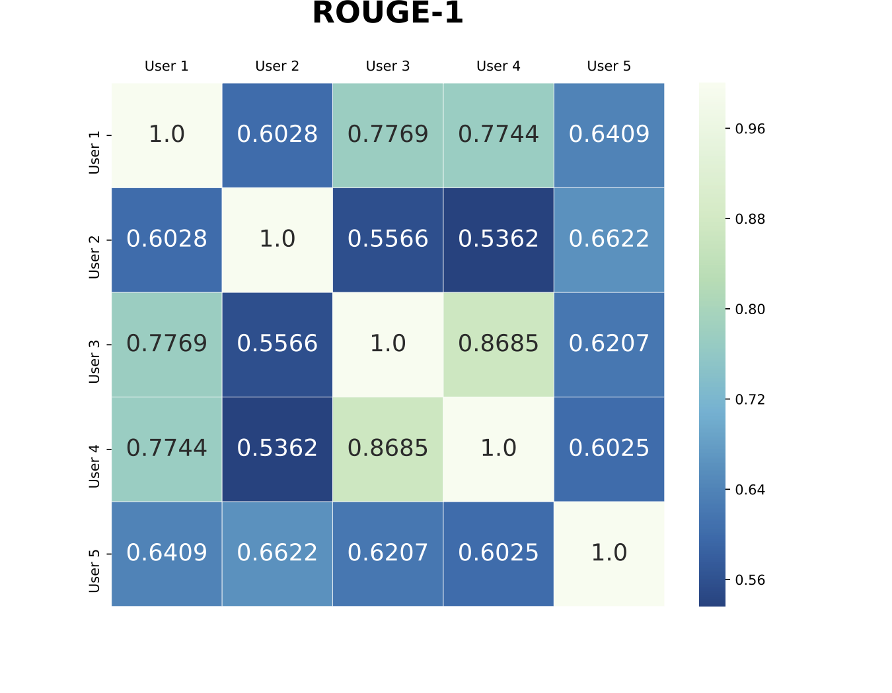
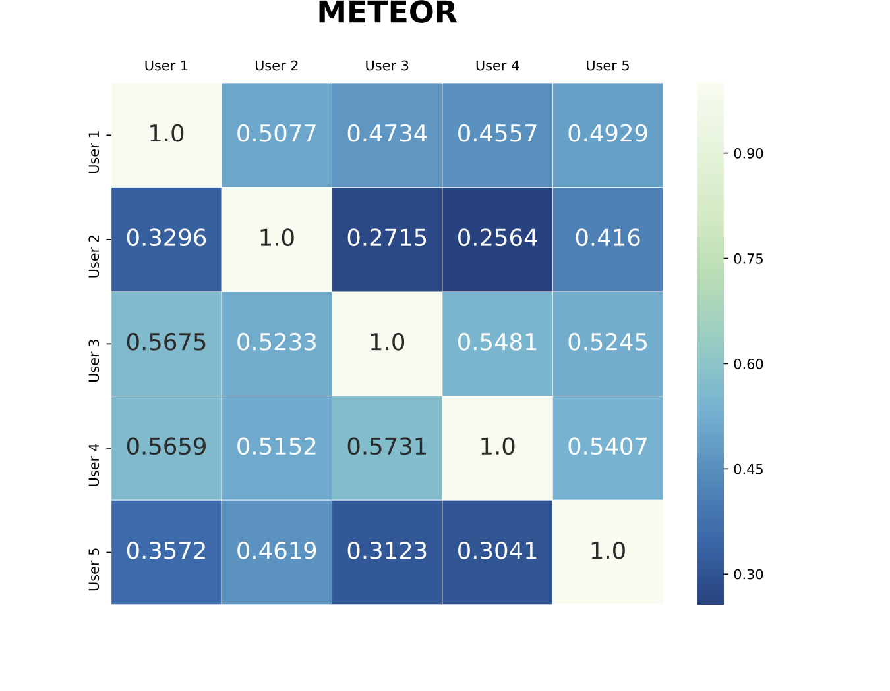
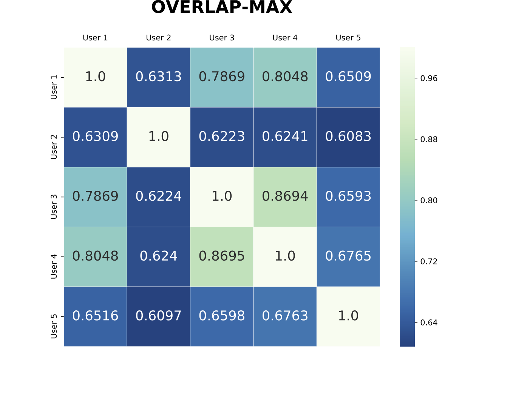
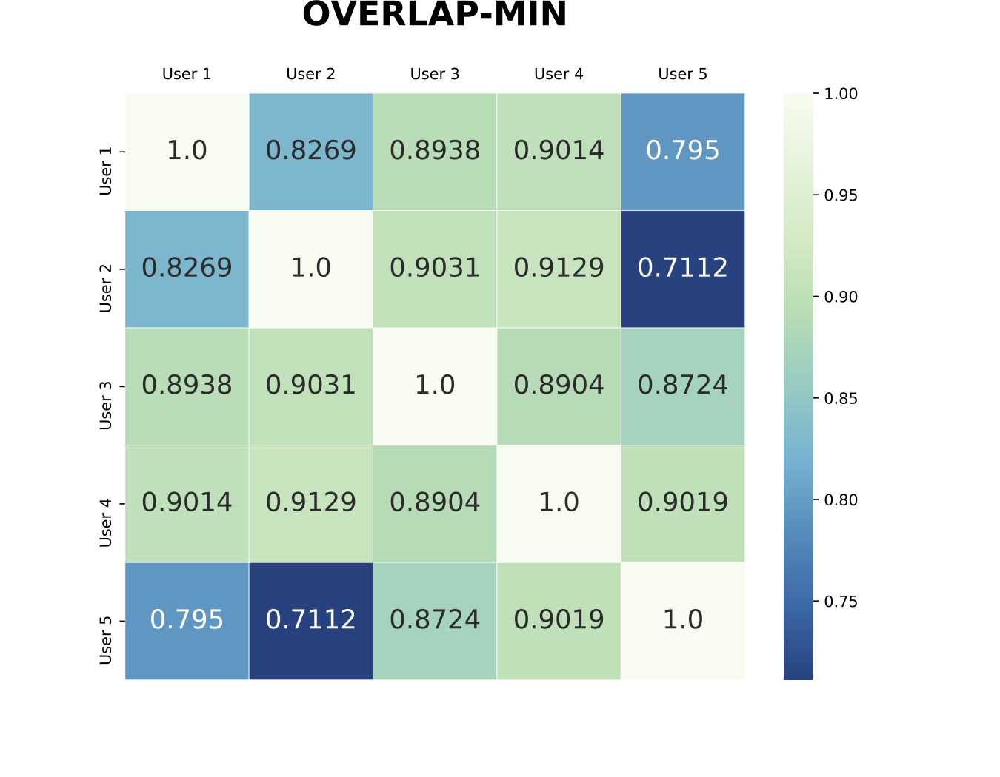
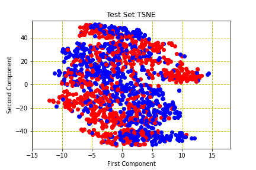
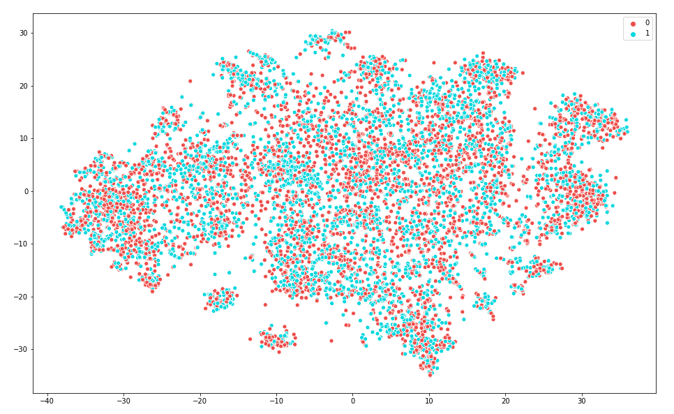

The main results are there in the paper due to space constraints we are not able to show additional results and experiments. These results are extension to the results in the paper.

## Token visualization heatmap using Integrated Gradient for BERT model (document name 1951_33.txt)

## Explanation agreement among the annotators

## TSNE visualization on the test set using the BERT 

## TSNE visualization on the test set using the Doc2Vec

## Plot between different Averaged Chunk sizes vs Attention Score

## Plot between different Averaged Chunk sizes vs Occlusion Score

